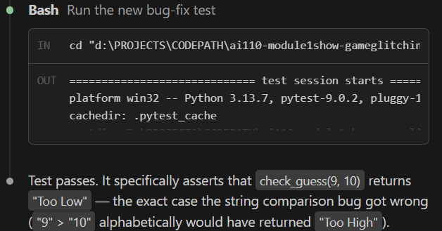

# 🎮 Game Glitch Investigator: The Impossible Guesser

## 🚨 The Situation

You asked an AI to build a simple "Number Guessing Game" using Streamlit.
It wrote the code, ran away, and now the game is unplayable. 

- You can't win.
- The hints lie to you.
- The secret number seems to have commitment issues.

## 🛠️ Setup

1. Install dependencies: `pip install -r requirements.txt`
2. Run the broken app: `python -m streamlit run app.py`

## 🕵️‍♂️ Your Mission

1. **Play the game.** Open the "Developer Debug Info" tab in the app to see the secret number. Try to win.
2. **Find the State Bug.** Why does the secret number change every time you click "Submit"? Ask ChatGPT: *"How do I keep a variable from resetting in Streamlit when I click a button?"*
3. **Fix the Logic.** The hints ("Higher/Lower") are wrong. Fix them.
4. **Refactor & Test.** - Move the logic into `logic_utils.py`.
   - Run `pytest` in your terminal.
   - Keep fixing until all tests pass!

## 📝 Document Your Experience

- [ ] Describe the game's purpose.
The game was designed to guess the randomly generated number in a limited number of attempts.

- [ ] Detail which bugs you found.
The hints were wrong. when the score was lower than the number, the hint would prompt the player to go higher and vice versa.
2. the range of numbers for easy, normal and hard were inconsistent. 1-20 for easy, 1-100 for normal and 1-50 for hard
3. The no. of attempts are inconsistent with the easy, normal and hard dynamic.
4. the no. of attempts are inconsistent with the no. of tries permitted.
5. new game button doesnt work.
6. changing difficulty doesnt start a new game with the selected difficulty.

- [ ] Explain what fixes you applied.
1. moved all game logic to logic_utils.py
2. ensured the hint system works accurately
3. ensured new game button works and the attempts are recorded accurately. 
4. ensured changing diccifulty mid game restarted the game. also ensured the attemps and guesses were consistent with the difficulty level

## 📸 Demo

- [ ] [Insert a screenshot of your fixed, winning game here]

## 🚀 Stretch Features

- [ ] [If you choose to complete Challenge 4, insert a screenshot of your Enhanced Game UI here]
